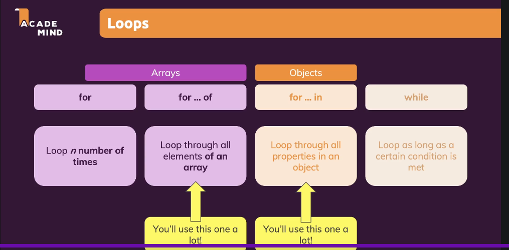

# Loops



-   `for`
-   `for of`
-   `for in`
-   `while`

## `for` loop

```javascript
// when you know that a function should run for certain number
// of time then you can use `for loop`

for (let i = 0; i < 10; i++) {
	console.log(i);
}
```


## `for of` Loop

```javascript
//  works on all the elements of array

let heroes = ["superman", "batman", "Wolverine"];

for (const hero of heroes) {
	console.log(hero);
}

// you can also use "for" loop on arrays as well

for (let i = 0; i < heroes.length; i++) {
	const hero = heroes[i];
	console.log(hero);
}
```


## `for in` loop

```javascript

let object = {
	name: "superman",
	otherName: "kal-el",
	enemy: "lex-luther",
	age: 32,
	haveSuperpower: true
};

for (const key in object) {
	console.log(key);
	console.log(object[key]); //same as console.log(object.name), but for all objects
}
```

## `while` loop

```javascript
// "while" loop (while something is true / false)

let confirmExit = false;

while (!confirmExit) {
	confirmExit = confirm("Are you sure you want to quit?");
}

console.log("done");
```